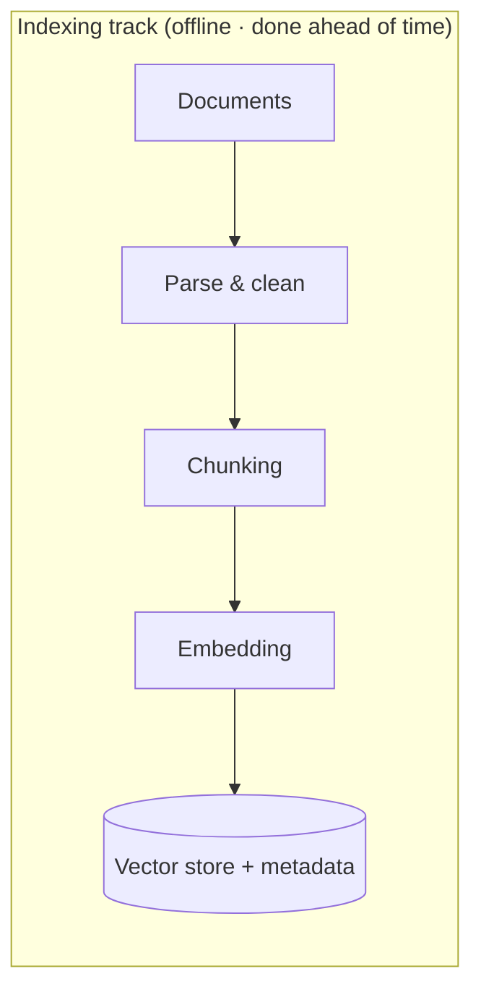
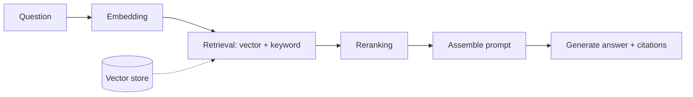

# Ch3 RAG: Letting the Model Take an Open-Book Exam

## Chapter Goals

By the end of this chapter you'll be able to: (1) draw and walk through the entire RAG pipeline on a whiteboard; (2) for each stage, answer "why this choice, and when would you swap it out"; (3) when facing "retrieval is off" or "the answer is wrong," diagnose it systematically; (4) master the single most important technical capability for Taiwanese FDE work.

---

## 3.1 Why We Need RAG: If You Can't Pass the Closed-Book Exam, Go Open-Book

Chapter 1 covered this: the model doesn't have your company's data, its knowledge has a cutoff date, and it can't cite sources. So how do you get it to answer "our company's leave policy"?

Three options: (a) retrain the model (unrealistically expensive); (b) stuff all your documents into the prompt (won't fit, too expensive, loses focus in the middle); (c) **each time, pull out only "the few passages relevant to this question" and hand them over**—that's RAG (Retrieval-Augmented Generation).

The metaphor: **turning a closed-book exam into an open-book one**. The model is still the same model, but we now let it "flip through the reference book during the exam"—and our engineering job is to organize that book for it, build the index, and turn to the right page.

RAG answers three core enterprise needs: knowledge that **updates instantly** (just edit the document, no need to touch the model), **citable sources** (the foundation of trust), and **controllable permissions** (who can see what is decided at the retrieval layer).

## 3.2 The Full Pipeline at a Glance

RAG splits into two tracks: **building the index (offline, done ahead of time)** and **querying (online, on every Q&A)**.

When you need to "design a RAG system," draw these two tracks first, then expand stage by stage. Here we go through each stage in turn.

## 3.3 Document Processing: Unsexy, but It Sets the Ceiling

**Garbage in, garbage out.** In practice, more than half the effort on a RAG project goes here:

- **Format parsing**: PDF tables, two-column layouts, scanned files (need OCR), text inside images—every one of these is a pitfall. Parse it wrong and everything downstream is wasted.
- **Cleaning**: headers and footers, tables of contents, repeated disclaimers—this noise pollutes retrieval.
- **Metadata preservation**: source filename, section, date, version, **permission labels**—downstream filtering, citation, and access control all depend on it.

> Wisdom from the field, FDE edition: before taking a project, look at the "actual state" of the client's documents before quoting a timeline. The client says "our documents are well organized," you open them up and find 20-year-old scans with handwritten notes—that's the difference between a three-week project and a three-month one.

## 3.4 Chunking: Cutting the Book into Cards

Documents are too long to retrieve whole—you have to cut them into **chunks**, because the unit of retrieval is the chunk.

How do you cut? Two schools of thought:

1. **Fixed length + overlap**: e.g., roughly 500–1000 tokens per chunk, with 10–20% overlap between adjacent chunks (to avoid a sentence being cut in half at the boundary). Simple, stable, and **always start with this as your baseline**.
2. **Structural / semantic splitting**: split by heading, paragraph, or section. Works better when the document has good structure (manuals, regulations).

The core tradeoff: **small chunks → precise retrieval, but the context you pull back is fragmented; large chunks → complete context, but retrieval gets fuzzy and costs more.** There's no universal size—**decide it with evals** (Chapter 6).

An advanced move: **parent-document**—retrieve with small chunks (for precision), then once you get a hit, hand the model the large passage the chunk belongs to (for completeness). You get the best of both ends; the cost is storage and complexity.

## 3.5 Embedding: Turning Meaning into Coordinates

An **embedding model** turns text into a high-dimensional vector (hundreds to thousands of numbers). The magic: **text that's close in meaning has vectors that are close in distance.** "Leave policy" and "vacation rules" differ literally, but they're neighbors in the vector space.

Think of it as a **semantic map**: every passage of text is pinned to a coordinate on the map, and finding relevant content = finding neighbors on the map.

Key selection points:

- **Language support**: for Chinese use cases you must pick a multilingual or Chinese-strong embedding model—this is a real pitfall in Taiwan
- **Within one system, queries and documents must use the same embedding model** (different models have incompatible coordinate systems)
- **Swapping the embedding model = recomputing the entire index**—choose carefully, and schedule migrations

## 3.6 Vector DB and ANN: Finding the Nearest Among Millions of Neighbors

Once you have vectors, "retrieval" = "finding the top-k vectors nearest to the question vector among millions." Comparing them one by one is too slow, so we use an **ANN (Approximate Nearest Neighbor)** index—sacrificing a tiny bit of accuracy for a thousandfold speedup. The mainstream algorithm is **HNSW**; in one line: "a multi-layer graph index that trades space for speed, like coming off a highway layer by layer down to the back alleys to find an address."

Selection (Taiwan practice):

| Option | When to use |
|---|---|
| **pgvector** (a PostgreSQL extension) | **Default first choice**: the client already has Postgres, so one fewer component, one fewer thing to operate, and permissions inherit the DB's existing mechanisms |
| Dedicated stores like Qdrant / Milvus | Large vector volume (tens of millions or more), need advanced filtering and performance tuning |
| Managed cloud (Vertex AI Search, etc.) | The client is all-in on that cloud and accepts a managed service |

> In one line: "My default is pgvector—in an enterprise environment, every extra component adds another round of operations and security review. A dedicated vector store is an upgrade for when scale demands it, not an opening move." (This signals that you "understand the enterprise field.")

## 3.7 Hybrid Search: Using Keywords to Cover the Vector's Blind Spots

Pure vector retrieval has one fatal blind spot: **exact terms.** Model numbers like "TX-4090-B," personal names, statute numbers, error codes—semantic similarity helps little here; instead it's **keyword retrieval (BM25)**, a thirty-year-old technique, that's best at these.

So enterprise-grade RAG almost always adds **hybrid search**: vector (handling meaning) + BM25 (handling exact terms) each pull a set, then merge and rank. A user asks about "the warranty for the TX-4090-B"—keywords guarantee the model number is hit, and the vector guarantees the semantic expansion to "warranty / repair / after-sales."

## 3.8 Reranking: Fine Selection After the Rough Cut

Retrieval optimizes for speed, so it inevitably pulls back some not-so-relevant items. **Reranking**: the first stage quickly pulls the top 30–50 (rough cut), then a more refined reranker model compares each one against "just how relevant is this passage to the question," selecting the top 3–5 to hand the model.

The metaphor: **a hiring process**—résumé keyword screening (retrieval) pulls 50 people, then one-by-one interviews (rerank) select 5. You wouldn't put all 50 into the final round (expensive), nor dare send an offer based on keywords alone (inaccurate).

When "retrieval quality isn't good enough," rerank is the first card to consider—far cheaper than swapping the embedding model.

## 3.9 Generation and Citation: Discipline for the Last Mile

Assemble the retrieved content into the prompt, along with three iron rules:

1. **Answer only based on the provided content**—don't fill in gaps with your own knowledge
2. **Cite sources**—for every claim, note which document and which passage it came from
3. **If it's not there, say so**—if the answer can't be found in the content, say so plainly; speculation is forbidden

Citation isn't decoration—it's the **cornerstone of enterprise trust** (users can verify), a **debugging clue** (when the answer's wrong, look at what it cited), and the **boundary of responsibility** (the AI saying "per document X" and "I think" are two different things).

**A word about permissions again here (a security red line)**: documents a user isn't authorized to see must be **filtered out at the retrieval layer** (via metadata permission labels), not retrieved and then told to the model "don't mention this." The prompt is not a security boundary (detailed in Chapter 8).

## 3.10 Failure-Mode Diagnostic Table (Differential Diagnosis for RAG)

The system got the answer wrong—how do you investigate? First ask one question to locate the lesion: **"Did retrieval pull back the content the model should have seen?"**

| Symptom | Lesion | Prescription |
|---|---|---|
| Content was retrieved, but the answer is still wrong | **Generation problem** | Fix the prompt (the three iron rules), swap the model, reduce in-chunk noise |
| Content wasn't retrieved | **Retrieval problem** | Add hybrid / rerank, revisit chunking, check the embedding's language fit |
| The answer requires stitching several chunks together | **Chunking problem** | Parent-document, larger chunks, or multi-hop retrieval |
| Retrieved an outdated version | **Metadata problem** | Version field + retrieval filter for the latest version |
| Retrieved content the user isn't authorized to see | **Permission hole (P0)** | Permission filtering at the retrieval layer, fix immediately |

This table is the standard way to handle "the client says RAG got an answer wrong, what do you do": **first split it into a retrieval problem versus a generation problem, then treat the specific cause**—and the prerequisite for telling these two apart is that you have evals (Chapter 6: retrieval hit rate and answer correctness must be measured separately).

---

## Common Misconceptions

1. **"RAG is just hooking up a vector database"**—the vector store is only one of seven stages. Document processing and evals are where the real hours go.
2. **"If it retrieves it, it'll answer correctly"**—retrieval and generation are two independent failure points; measure them separately, fix them separately.
3. **"Vector search is more advanced than keyword search, so it replaces it"**—exact terms are the vector's blind spot; enterprise scenarios need hybrid.
4. **"There's a best-practice number for chunk size"**—there's only a baseline starting point (500–1000 tokens); the best value is decided by your documents and your evals.
5. **"RAG guarantees no hallucination"**—it greatly reduces it, but can't zero it out. That's why you need citation (verifiable) + evals (measurable) + human review for high-risk scenarios. Be honest with the client about this (client simulation #3 in the question bank is exactly this).

## Self-Check

1. Draw RAG's two tracks (indexing / querying) on a whiteboard, and give a one-sentence reason each stage exists.
2. The client asks "why not just give the AI all the documents"—three reasons.
3. What's the tradeoff in chunk size? How would you decide how big to make them?
4. In what situations does pure vector retrieval fail? How do you cover for it?
5. A user reports "the AI got it wrong"—walk through your full diagnostic process.
6. At which layer should access control be done? Why can't you rely on the prompt?

## Key Points for Reference Answers

    1. See 3.2; the reason for each stage is scattered across the sections.
    2. Won't fit (the window), too expensive (per-token billing), and even if it fits it loses focus (lost in the middle).
    3. Small = precise but fragmented, large = complete but fuzzy; start with 500–1000 + overlap as the baseline, and use the eval set's retrieval hit rate and answer correctness to decide the direction of adjustment; use parent-document when necessary.
    4. Exact terms (model numbers / names / IDs); add hybrid (BM25 + vector).
    5. First check whether that content was retrieved → yes = generation problem (prompt/model), no = retrieval problem (hybrid/rerank/chunking/embedding) → cross-reference the table in 3.10.
    6. The retrieval layer (metadata permission filtering); the model can't tell instructions from data, so a "don't mention this" at the prompt layer can be bypassed—the prompt is not a security boundary.
