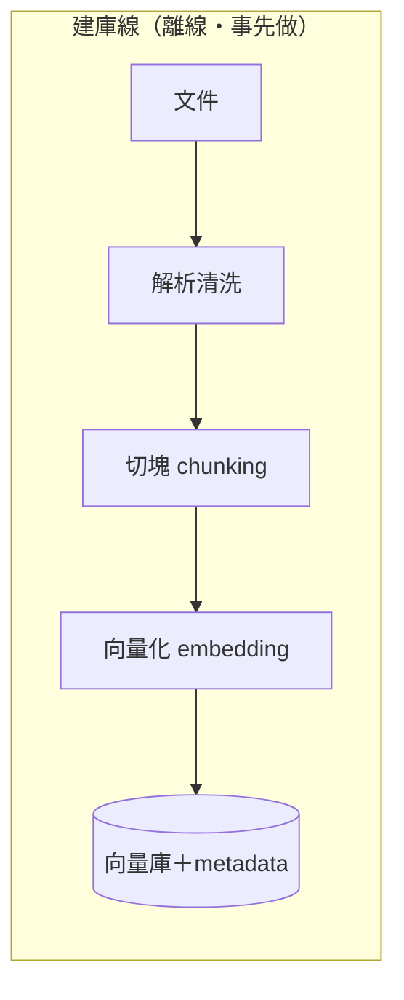
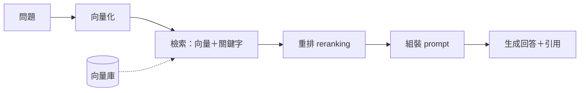

# Ch3 RAG：讓模型開卷考試

## 本章目標

讀完本章你能：(1) 白板畫出並講解 RAG 全鏈路；(2) 對每個環節回答「為什麼這樣選、什麼情況會換」；(3) 面對「檢索不準」「答錯了」能系統性診斷；(4) 通過台灣 FDE 面試最核心的技術關。

---

## 3.1 為什麼需要 RAG：閉卷考不過，就開卷

第一章講過：模型沒有你公司的資料、知識有截止日、也無法引用出處。怎麼讓它回答「我們公司的請假規則」？

三個選項：(a) 重新訓練模型（貴到不現實）；(b) 把全部文件塞進 prompt（塞不下、太貴、中段失焦）；(c) **每次只把「跟這個問題相關的幾段」找出來塞給它**——這就是 RAG（Retrieval-Augmented Generation，檢索增強生成）。

比喻：**閉卷考試改開卷**。模型還是那個模型，但我們允許它「考試時翻參考書」——而我們的工程工作，是幫它把書整理好、建索引、翻到對的那一頁。

RAG 回答了企業的三大需求：知識**即時更新**（改文件就好，不用動模型）、**可引用出處**（信任的基礎）、**可控權限**（誰能看什麼，在檢索層決定）。

## 3.2 全鏈路總覽

RAG 分兩條線：**建庫（離線，事先做）**與**查詢（線上，每次問答）**。

面試被要求「設計一個 RAG」，先畫這兩條線，再逐環節展開。以下逐環節講。

## 3.3 文件處理：不性感，但決定上限

**Garbage in, garbage out。** 實務上 RAG 專案一半以上的工夫花在這裡：

- **格式解析**：PDF 的表格、雙欄排版、掃描檔（要 OCR）、圖片內文字——每一種都是坑。解析錯，後面全白搭。
- **清洗**：頁首頁尾、目錄、重複的免責聲明——這些雜訊會污染檢索。
- **Metadata 保留**：來源檔名、章節、日期、版本、**權限標籤**——後面過濾、引用、權控全靠它。

> FDE 現場智慧：接案先看客戶文件的「真實樣貌」再報時程。客戶說「我們文件很齊全」，打開一看是 20 年的掃描件加手寫註記——這決定專案是三週還是三個月。（面試講這個認知，直接顯出你懂現場。）

## 3.4 Chunking：把書切成卡片

文件太長，不能整份檢索——要切成**塊（chunk）**，檢索的單位是塊。

怎麼切？兩派：

1. **固定長度＋重疊**：例如每塊約 500–1000 token、相鄰塊重疊 10–20%（避免一句話被腰斬在邊界上）。簡單、穩定、**永遠先用這個當基準**。
2. **結構／語意切分**：按標題、段落、章節切。文件結構好（手冊、法規）時效果更佳。

核心取捨（面試必考，背這句）：**塊小 → 檢索精準，但撈回來的上下文碎；塊大 → 上下文完整，但檢索變糊、又貴。** 沒有萬用尺寸——**用 eval 定**（第六章）。

進階招：**parent-document**——用小塊做檢索（求準），命中後把它所屬的大段落給模型（求全）。兩頭的好處都拿到，代價是儲存與複雜度。

## 3.5 Embedding：把語意變座標

**Embedding 模型**把文字轉成一個高維向量（幾百到幾千個數字）。神奇之處：**語意相近的文字，向量距離近**。「請假規定」和「休假辦法」字面不同，但在向量空間裡是鄰居。

把它想成**語意地圖**：每段文字被釘在地圖上的一個座標，找相關內容＝找地圖上的鄰居。

選型要點：

- **語言支援**：中文場景必須選多語或中文強的 embedding 模型——這在台灣是真實踩坑點
- **同一系統，查詢與文件必須用同一個 embedding 模型**（不同模型的座標系不相容）
- **換 embedding 模型＝全庫重算**——選型要慎重，遷移要排程

## 3.6 Vector DB 與 ANN：在百萬鄰居中找最近的

有了向量，「檢索」＝「在幾百萬個向量中找出跟問題向量最近的 top-k」。逐一比對太慢，所以用 **ANN（Approximate Nearest Neighbor，近似最近鄰）**索引——犧牲一點點精確，換取千倍速度。主流演算法叫 **HNSW**，面試講到這句就夠：「用空間換速度的多層圖索引，像從高速公路逐層下到巷弄找地址」。

選型（台灣實務）：

| 選項 | 何時用 |
|---|---|
| **pgvector**（PostgreSQL 擴充） | **預設首選**：客戶已有 Postgres，少一個元件、少一套維運、權限沿用 DB 既有機制 |
| Qdrant / Milvus 等專用庫 | 向量量級大（千萬以上）、需要進階過濾與效能調校 |
| 雲託管（Vertex AI Search 等） | 客戶全家桶在該雲上、接受託管 |

> 面試金句：「我的預設是 pgvector——企業環境每多一個元件就多一套維運與資安審查。專用向量庫是規模需求出現後的升級，不是起手式。」（這是「懂企業現場」的訊號。）

## 3.7 Hybrid Search：向量的死角用關鍵字補

純向量檢索有個致命死角：**精確詞**。型號「TX-4090-B」、人名、法條編號、錯誤代碼——語意相似度對這些幫助有限，反而是三十年前就有的**關鍵字檢索（BM25）**最擅長。

所以企業級 RAG 幾乎必上 **hybrid search**：向量（管語意）＋BM25（管精確詞）各撈一份，合併排序。使用者問「TX-4090-B 的保固」，關鍵字保證型號命中，向量保證「保固/維修/售後」的語意展開。

## 3.8 Reranking：粗篩之後精選

檢索求快，難免撈回一些不太相關的。**Reranking（重排）**：第一階段快速撈 top 30–50（粗篩），再用一個更精細的 reranker 模型逐一比對「這段跟問題到底多相關」，精選出 top 3–5 給模型。

比喻：**招募流程**——履歷關鍵字篩選（檢索）撈 50 人，逐一面試（rerank）選 5 人。你不會讓 50 個人都進最終面（貴），也不敢只靠關鍵字就發 offer（不準）。

「檢索品質不夠」時，rerank 是第一張要考慮的牌——比換 embedding 模型便宜得多。

## 3.9 生成與引用：最後一哩的紀律

檢索到的內容組進 prompt，配上鐵律三條：

1. **只根據提供的內容回答**——不要用你自己的知識補
2. **標注出處**——每個論點註明來自哪份文件哪一段
3. **沒有就說沒有**——內容裡找不到答案，明說，禁止推測

引用（citation）不是裝飾——它是**企業信任的基石**（使用者能查證）、**除錯的線索**（答錯時看它引了什麼）、**責任的邊界**（AI 說「依據文件 X」跟「我覺得」是兩回事）。

**權限這件事在這裡再強調一次（安全紅線）**：使用者無權看的文件，必須在**檢索層就過濾掉**（靠 metadata 權限標籤），而不是檢索出來再叫模型「不要講」。Prompt 不是安全邊界（第八章詳述）。面試主動講出這點＝直接加分。

## 3.10 失敗模式診斷表（RAG 的鑑別診斷）

系統答錯了，怎麼查？先問一個問題定位病灶：**「該給模型看的內容，檢索有沒有撈到？」**

| 症狀 | 病灶 | 處方 |
|---|---|---|
| 內容撈到了，答案還是錯 | **生成問題** | 改 prompt（鐵律三條）、換模型、縮小塊內雜訊 |
| 內容沒撈到 | **檢索問題** | 上 hybrid／rerank、檢討 chunking、檢查 embedding 語言適配 |
| 答案需要跨好幾塊拼起來 | **chunking 問題** | parent-document、擴大塊、或多跳檢索 |
| 撈到過期版本 | **metadata 問題** | 版本欄位＋檢索過濾最新版 |
| 撈到使用者無權看的內容 | **權限漏洞（P0）** | 檢索層權限過濾，立刻修 |

這張表就是面試題「客戶說 RAG 答錯了，你怎麼辦」的標準答案：**先分檢索問題還是生成問題，再對症下藥**——而能分開這兩者的前提，是你有 eval（第六章：檢索命中率與答案正確率要分開量測）。

---

## 常見誤解

1. **「RAG 就是接個向量資料庫」**——向量庫只是七個環節之一。文件處理與 eval 才是工時大頭。
2. **「檢索到了就會答對」**——檢索與生成是兩個獨立故障點，要分開量測、分開修。
3. **「向量搜尋比關鍵字先進，所以取代它」**——精確詞是向量的死角，企業場景要 hybrid。
4. **「chunk 尺寸有最佳實踐數字」**——只有基準起點（500–1000 token），最佳值由你的文件與 eval 決定。
5. **「RAG 能保證不幻覺」**——大幅降低、不能歸零。所以要引用（可查證）＋evals（可量測）＋高風險場景人審。對客戶要誠實講這點（題庫 client simulation #3 就是這題）。

## 自我檢測

1. 白板畫出 RAG 兩條線（建庫／查詢），每個環節一句話說明它存在的理由。
2. 客戶問「為什麼不把全部文件都給 AI 就好」——三個理由。
3. chunk 大小的取捨是什麼？你會怎麼決定用多大？
4. 什麼情況純向量檢索會失敗？怎麼補？
5. 使用者回報「AI 答錯了」——完整走一遍你的診斷流程。
6. 權限控制應該做在哪一層？為什麼不能靠 prompt？

??? note "參考答案要點"

    1. 見 3.2；每環節理由散見各節。
    2. 塞不下（視窗）、太貴（token 計費）、塞了也失焦（lost in the middle）。
    3. 小=準但碎、大=全但糊；先 500–1000＋重疊當基準，用 eval set 的檢索命中率與答案正確率決定調整方向；必要時 parent-document。
    4. 精確詞（型號/人名/編號）；上 hybrid（BM25＋向量）。
    5. 先看該內容有沒有被檢索到 → 有=生成問題（prompt/模型），沒有=檢索問題（hybrid/rerank/chunking/embedding）→ 對照 3.10 表。
    6. 檢索層（metadata 權限過濾）；模型無法區分指令與資料，prompt 層的「不要講」可被繞過——prompt 不是安全邊界。

## 面試連結

`interview/question-bank.md` 第七部分 #3（chunking 答辯）、第四部分 #1（VPC 內 RAG 設計）、第六部分 #3（向 VP 解釋不能 100% 準確）、coding 題 C7（徒手最小 RAG）。W3 實作驗收：為 Trilo 建 eval 的作業會用到 3.10 的診斷思維。
