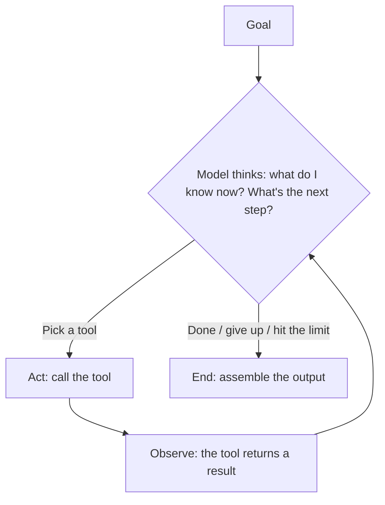

# Ch4 Agents and Tool Use: From Answering Questions to Getting Things Done

## Chapter Goals

By the end of this chapter you'll be able to: (1) explain the full mechanics of function calling (who decides, who executes); (2) draw the agent loop on a whiteboard; (3) design guardrails and answer "what happens when an agent does the wrong thing?"; (4) turn your two years of hands-on agent experience into theory, so you can articulate it clearly.

---

## 4.1 The Dividing Line Between Chatbot and Agent

- **Chatbot**: you ask, it answers. Its impact stops at "a piece of text."
- **Agent**: you give it a goal, and it **plans multiple steps, calls tools, and adjusts based on the results** until the job is done. Its impact reaches into "the real world"—it queried a database, sent an email, changed a file.

Analogy: a chatbot is a **directory assistance line** (ask a question, get an answer); an agent is **sending an assistant off to run errands** ("arrange my business trip for next week"—and it goes and checks flights, compares prices, books tickets, and hands you an itinerary).

This dividing line shifts where the engineering effort goes (in one line): **the engineering focus for a chatbot is "answering well"; the engineering focus for an agent is "controlling the blast radius of doing the wrong thing."** It's fine when your assistant says the wrong thing; it's a problem when your assistant charges the wrong card.

## 4.2 Function Calling: The Truth About How a Model "Takes Action"

The foundational mechanism of an agent is **function calling (tool use)**. The key insight: **from start to finish, the model never executes anything—it merely "says" what it wants to call; the one doing the executing is always your program.**

The full flow has five steps (you should be able to draw it from memory):

```
1. You give the model: the task + a tool list (each tool: name, description of what it does, parameter schema)
2. The model outputs: "I want to call get_order_status(order_id="A1234")"   ← just structured text!
3. Your program: validates this request → actually calls the API → gets the result
4. You feed the result back to the model
5. The model continues: either calls the next tool, or assembles the final answer
```

Step 3 is **where the power lies**: whether to execute, whether the parameters are valid, whether this user has permission, whether to ask a human first—all of it is gated by your program. The model proposes; the system decides.

Tool design principles (you've written an MCP server, so map your experience onto these):

- **Write the description for the model to read**: a tool's description is the model's only basis for deciding "when to use it"—spell out clearly when it should and shouldn't be used
- **Keep the parameter schema narrow**: use enums whenever you can enumerate the options; don't use free-form strings that accept anything
- **Make return values model-friendly**: error messages should guide the next step ("order not found, please confirm the format is 'A' followed by 4 digits") rather than dumping a stack trace

## 4.3 The Agent Loop: The Sense–Think–Act Cycle

Put function calling inside a loop and you have an agent (the classic pattern is called **ReAct**: Reasoning + Acting):



The loop introduces two new problems:

1. **It might not stop**—so always have a **limit**: at most N steps, at most X tokens, at most Y seconds. A limit is both cost insurance and a safety brake.
2. **Errors compound**—a wrong read at step 3, and a decision built on that wrong data at step 7. The longer the sequence, the more you need mid-course checkpoints (verifying key steps, or human confirmation).

## 4.4 Memory: An Agent's Three Kinds of Memory

| Type | What it is | Implementation |
|---|---|---|
| Short-term | The conversation and tool results from the current task | It's just the context window; when it fills up, summarize and compress |
| Long-term | Facts and preferences to remember across tasks | Stored externally (DB/files), retrieved and fed back in when needed—**this is essentially RAG** |
| Working state | The plan and intermediate artifacts while a task is in progress | Todo lists, scratch files—so long tasks are recoverable and auditable |

The key insight: the model itself is always memoryless (Chapter 1); all "memory" is **application-layer engineering**—deciding what to store, when to retrieve it, and how to put it back into the context.

## 4.5 Multi-Agent: When to Split, When Not To

Splitting a task across multiple specialized agents (planner/executor/reviewer) has both benefits and costs:

- **Benefits**: separation of concerns (each agent's prompt is simple, its tool set small), parallelism, and **independent review** (the reviewer isn't contaminated by the executor's line of thinking—your multi-model cross-review is exactly this principle)
- **Costs**: coordination complexity, errors propagating and amplifying at handoffs, multiplied cost, and harder debugging

**Core stance**: "Get a single agent working well first. Splitting needs a clear reason—my practical experience is that 'review independence' is the most defensible reason to split, which is why I do multi-model cross-review." Turn your hands-on experience directly into an argument.

## 4.6 Guardrails: Controlling the Blast Radius of Doing the Wrong Thing

The four gates of agent safety design (you should be able to rattle them off in one breath):

1. **Least privilege**: give only the minimal tool set needed to finish the task; read-only first; if it only needs to read, don't let it write; if it only needs to change one record, don't let it change all of them
2. **Human confirmation for high-risk actions**: writes, deletes, outbound sends, money movement—the model proposes, a human clicks the button
3. **Output and parameter validation**: run tool parameters through a whitelist / schema check; block abnormal parameters ("delete *") outright
4. **Budget limits and audit logs**: step/token/time limits; every action leaves a trace so it can be traced back afterward

Analogy: **managing a new employee's permissions**. No matter how smart a newcomer is, you don't hand them write access to the production DB on day one—it's not distrust of their intelligence, it's systematic risk management. Enterprise customers get this analogy instantly (their internal controls already work this way—this is where your Taishin experience connects).

---

## Common Misconceptions

1. **"The agent executed the tool itself"**—it's always the host program that executes. This misconception makes you put your safety design in the wrong place.
2. **"Agents are smarter"**—same model. An agent is an **architecture** (loop + tools), not a stronger brain.
3. **"Multi-agent is advanced, so it's better"**—a multi-agent setup with no clear reason to split is a self-inflicted distributed-systems headache.
4. **"The more tools, the more capable"**—too many tools and the model picks the wrong one. Keep the tool set lean and the descriptions precise.
5. **"When an agent errs, it's the model's fault"**—no limits, no confirmation gates, no auditing: that's a system-design problem.

## Self-Check

1. Draw the five-step function calling flow from memory, and point out which step holds the "power" and why.
2. How does the engineering focus differ between a chatbot and an agent? (Say the "blast radius" line.)
3. What are an agent's three kinds of memory, and how is each implemented?
4. A customer asks, "Will the agent go rogue?"—answer with the four gates, plus an analogy the customer can understand.
5. In what situation would you split into multi-agent? In what situation wouldn't you? Use an example from your own experience.

## Key Points for the Answers

    1. See 4.2; the power is in step 3 (validation before execution)—the model only proposes, the system decides.
    2. Answering well vs. controlling the blast radius of doing the wrong thing.
    3. Short-term = context, long-term = external storage (essentially RAG), working state = todo/intermediate artifacts.
    4. Least privilege, human confirmation, parameter validation, limits + auditing; the new-employee permissions analogy.
    5. Defensible reasons: review independence (multi-model cross-review), separation of concerns; get a single agent working well by default first.
