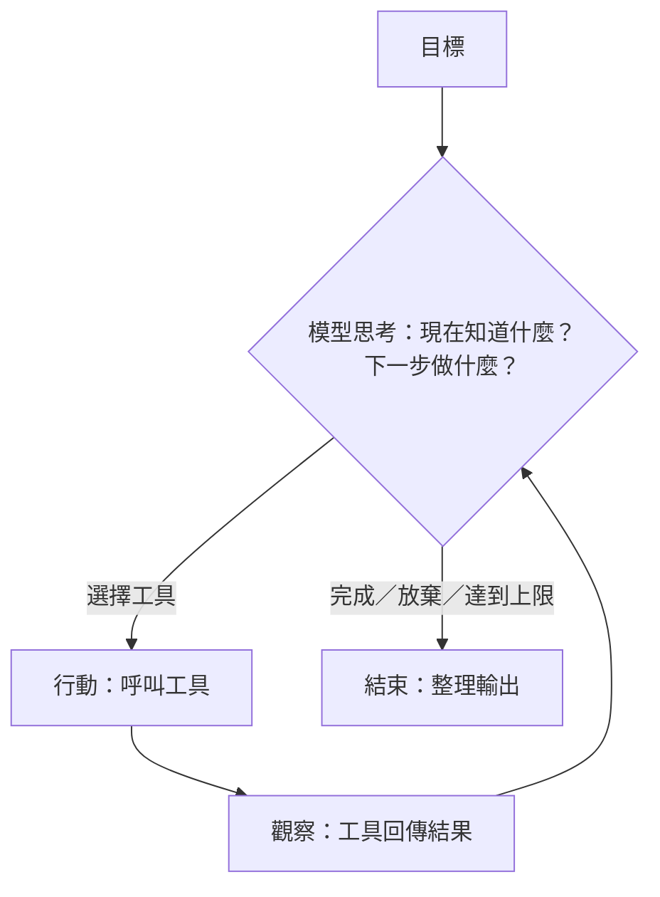

# Ch4 Agent 與 Tool Use：從回答問題到完成任務

## 本章目標

讀完本章你能：<br>(1) 講清楚 function calling 的完整機制（誰決定、誰執行）；<br>(2) 白板畫出 agent loop；<br>(3) 設計 guardrails 並回答「agent 做錯事怎麼辦」；

---

## 4.1 Chatbot 與 Agent 的分界線

- **Chatbot**：你問，它答。影響範圍止於「一段文字」。
- **Agent**：你給目標，它**規劃多個步驟、呼叫工具、根據結果調整**，直到完成。影響範圍及於「真實世界」——它查了資料庫、發了郵件、改了檔案。

比喻：chatbot 是**查號台**（問什麼答什麼）；agent 是**派一位助理去辦事**（「幫我把下週出差安排好」——他自己會查班機、比價、訂票、寫行程給你）。

這條分界線帶來工程重點的轉移（一句話總結）：**chatbot 的工程重點是「答得好」；agent 的工程重點是「做錯事的半徑控制」。** 助理答錯話沒關係，助理刷錯卡就有關係了。

## 4.2 Function Calling：模型「動手」的真相

Agent 的基礎機制是 **function calling（tool use）**。關鍵認知：**模型從頭到尾沒有執行任何東西——它只是「說」它想呼叫什麼，執行的永遠是你的程式。**

完整流程五步（要能默畫）：

```
1. 你給模型：任務 ＋ 工具清單（每個工具：名稱、功能描述、參數 schema）
2. 模型輸出：「我要呼叫 get_order_status(order_id="A1234")」   ← 只是結構化文字！
3. 你的程式：驗證這個請求 → 真的去呼叫 API → 拿到結果
4. 你把結果回填給模型
5. 模型繼續：或再叫下一個工具，或整理成最終回答
```

第 3 步是**權力所在**：要不要執行、參數合不合法、這個使用者有沒有權限、要不要先問過人類——全部由你的程式把關。模型提議，系統決定。

工具設計心法（你寫過 MCP server，把經驗對號入座）：

- **描述寫給模型看**：工具的 description 是模型決定「何時用它」的唯一依據——寫清楚何時該用、何時不該用
- **參數 schema 要窄**：enum 能列舉就列舉，別用自由字串接受一切
- **回傳要對模型友善**：錯誤訊息要能引導下一步（「訂單不存在，請確認格式為 A 開頭＋4 碼」），而不是丟 stack trace

## 4.3 Agent Loop：感知—思考—行動的循環

把 function calling 放進迴圈，就是 agent（經典模式叫 **ReAct**：Reasoning + Acting）：



迴圈帶來兩個新問題：

1. **它可能不停下來**——所以永遠要有**上限**：最多 N 步、最多 X token、最多 Y 秒。上限既是成本保險也是安全煞車。
2. **錯誤會累積**——第 3 步讀錯資料，第 7 步基於錯資料做決定。步驟愈長，愈需要中途檢核點（關鍵步驟驗證、或人工確認）。

## 4.4 Memory：Agent 的三種記憶

| 類型 | 是什麼 | 實作 |
|---|---|---|
| 短期 | 本次任務的對話與工具結果 | 就是 context window，滿了要摘要壓縮 |
| 長期 | 跨任務要記住的事實與偏好 | 存外部（DB/檔案），需要時檢索回填——**本質就是 RAG** |
| 工作狀態 | 任務進行中的計畫與中間產物 | todo 清單、暫存檔——讓長任務可恢復、可審計 |

認知重點：模型本身永遠無記憶（第一章），所有「記憶」都是**應用層工程**——決定存什麼、何時取回、怎麼塞回 context。

## 4.5 Multi-Agent：什麼時候拆、什麼時候不拆

把任務拆給多個各有分工的 agent（規劃者/執行者/審查者），收益與代價：

- **收益**：關注點分離（每個 agent 的 prompt 單純、工具集小）、可平行、**獨立審查**（審查者不受執行者的思路污染——你的多模型交叉審查正是這個原理）
- **代價**：協調複雜度、錯誤在交接時傳遞放大、成本倍增、難除錯

**核心立場**：「先把單一 agent 做好。拆分要有明確理由——我的實務經驗是『審查獨立性』是最站得住的拆分理由，這也是我做多模型交叉審查的原因。」把你的實戰直接變成論點。

## 4.6 Guardrails：做錯事的半徑控制

Agent 安全設計的四道閘（要能一口氣列出）：

1. **權限最小化**：只給完成任務的最小工具集；唯讀優先；能查的不給改，能改一筆的不給改全部
2. **高風險動作人工確認**：寫入、刪除、對外發送、金流——模型提議，人類按鈕
3. **輸出與參數驗證**：工具參數過白名單／schema 檢查；異常參數（「刪除 *」）直接攔
4. **預算上限與審計日誌**：步數/token/時間上限；每個動作留痕，事後可追溯

比喻：**新進員工的權限管理**。再聰明的新人，第一天也不會給 production DB 的寫入權——不是不信任智商，是系統性的風險管理。企業客戶聽這個比喻立刻懂（他們的內控本來就這樣做——你的台新經驗在此接上）。

---

## 常見誤解

1. **「Agent 自己執行了工具」**——永遠是 host 程式執行。這個誤解會讓你把安全設計想錯位置。
2. **「Agent 比較聰明」**——同一個模型。Agent 是**架構**（迴圈＋工具），不是更強的腦。
3. **「Multi-agent 是進階，所以更好」**——沒有明確拆分理由的 multi-agent 是自找的分散式系統難題。
4. **「給愈多工具愈萬能」**——工具太多模型會選錯。工具集要精，描述要準。
5. **「Agent 出錯是模型問題」**——沒有上限、沒有確認關卡、沒有審計，是系統設計問題。

## 自我檢測

1. 默畫 function calling 五步流程，指出「權力」在哪一步、為什麼。
2. Chatbot 與 agent 的工程重點差在哪？（要講出「半徑」那句）
3. Agent 的三種記憶各是什麼、怎麼實作？
4. 客戶問「agent 會不會亂做事？」——用四道閘回答，配一個客戶聽得懂的比喻。
5. 什麼情況你會拆 multi-agent？什麼情況不會？用你自己的實戰舉例。

## 參考答案要點

    1. 見 4.2；權力在第 3 步（執行前驗證），模型只提議、系統才決定。
    2. 答得好 vs 做錯事的半徑控制。
    3. 短期=context、長期=外部存取（本質 RAG）、工作狀態=todo/中間產物。
    4. 最小權限、人工確認、參數驗證、上限＋審計；新進員工權限比喻。
    5. 站得住的理由：審查獨立性（多模型交叉審查）、關注點分離；預設單 agent 做好先。