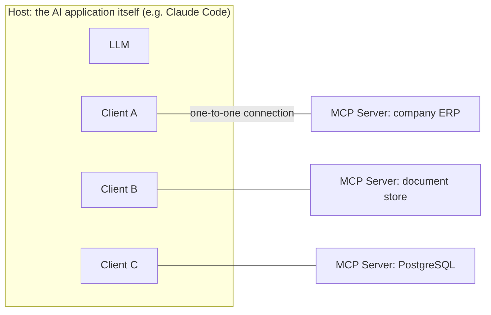

# Ch5 MCP: The USB-C of the AI World

## Chapter Goals

MCP is one of this book's core topics. By the end you'll be able to: (1) start from the N×M problem and clearly explain why MCP exists; (2) draw the full architecture on a whiteboard; (3) have three ready-to-go versions prepared — a 3-minute pitch, a 30-minute deep dive, and a customer-facing version; (4) package your own self-built server experience into a clear technical case study.

---

## 5.1 Why It Exists: The N×M Problem

Suppose you want to connect an AI application to enterprise systems. In the world before MCP:

```
3 AI applications (Claude, an internal chatbot, an IDE assistant)
× 4 systems (ERP, CRM, document store, database)
= 12 custom integrations, each one written and maintained by hand
```

Every new AI application means rewriting all the integrations from scratch; every new system means adding one to every application. This is the **N×M problem**.

The **MCP (Model Context Protocol)** solution: stand up a standard protocol in the middle. An application only has to "speak MCP" (done once), a system only has to "provide an MCP server" (done once), and N×M becomes **N + M**.

The metaphor (your customer-facing opener): **USB-C**. It used to be that every device had its own charging port; now everyone builds USB-C, and any charger works with any device. "Your internal systems just need to wrap a single MCP server around themselves, and after that, no matter which vendor's AI application you plug in, you never have to redo the integration." That sentence has a magical effect on enterprise IT leaders, because it answers the thing they fear most: **being locked into a single AI vendor**.

## 5.2 Architecture: Host, Client, Server



- **Host**: the AI application the user faces, which oversees everything
- **Client**: the connection manager inside the host, paired one-to-one with each server
- **Server**: the service that exposes some system's capabilities in a standard format — **this is exactly what you've been building yourself these past two years**

A server is usually small (wrapping one system, a handful of tools), and that's a strength: single responsibility, easy to review, easy to authorize.

## 5.3 The Three Things a Server Provides

| Type | What it is | Example |
|---|---|---|
| **Tools** | Actions the model can "call" (maps to function calling) | `query_orders(customer_id)`, `create_ticket(...)` |
| **Resources** | Data the model can "read" | File contents, DB schema, config files |
| **Prompts** | Pre-written prompt templates the user can pick and apply | A "generate weekly report" template |

In practice tools are the star of the show (about 80% of servers are tools-centric), but you should be able to speak to all three.

## 5.4 Transport: How It Connects

- **stdio**: the server runs as a child process of the host, communicating over standard input/output. The default for local tools — simple, with no network exposure surface.
- **HTTP (including SSE streaming)**: the server is a remote service. Use this for cross-machine access, multi-user sharing, and cloud deployment, paired with OAuth for authorization.

Rule of thumb for choosing: stdio for local personal use, HTTP for shared enterprise services.

## 5.5 A Key Distinction: How MCP Relates to Function Calling

The most common point of confusion. Here's how to frame it clearly:

> "The two are **different layers**, not competitors. Function calling is a **model-layer mechanism** — how the model expresses 'I want to call a tool'; MCP is an **integration-layer protocol** — how tools get discovered, connected, and provided in a standardized way. An MCP server's tools are, in the end, still handed to the model through function calling. What MCP solves isn't 'how the model uses tools,' it's 'how the tool ecosystem avoids reinventing the wheel.'"

To extend it further: "So MCP is a vendor-neutral open standard — and that's precisely why enterprises are willing to invest in wrapping an MCP server: that layer of investment doesn't get thrown away when you switch model vendors."

## 5.6 How Simple It Actually Is to Build a Server (Demystified)

With the official SDK, a minimal server looks roughly like this (Python, illustrative):

```python
from mcp.server.fastmcp import FastMCP

mcp = FastMCP("order-system")

@mcp.tool()
def query_order(order_id: str) -> str:
    """Look up order status. order_id format: an 'A' prefix + 4 digits."""
    return db.get_order(order_id).to_json()   # permission checks and parameter validation happen at this layer

mcp.run()  # defaults to stdio
```

The point isn't the amount of code (there's very little), it's the **design judgment** — and that comes down to a few key questions:

- How finely do you split the tools? (One all-powerful `run_sql` vs. three named queries — the latter is controllable, authorizable, and harder for the model to misuse)
- Who enforces permissions? (Do it at the server layer; don't trust the model's self-restraint)
- How do you return errors? (Return actionable messages that guide the model to fix its parameters)
- How do you write the descriptions? (These are the usage instructions written for the model to read, and they determine whether the model picks the right tool)

## 5.7 Your Three Versions

- **3-minute elevator version**: N×M problem → USB-C metaphor → "I've built N servers myself: which systems I connected, what repetitive-integration pain I solved" → one concrete result
- **30-minute whiteboard version**: the 5.2 architecture diagram → pick one server you built and walk it end to end: why you built it, how you split the tools, permission and error design, the pitfalls you hit (e.g. stdio debugging, schema evolution)
- **Customer-facing version** (for enterprise IT leaders): start from the "fear of lock-in" → open standard → "wrap one MCP layer, swap AI applications freely" → security Q&A (the server lives inside your environment, you control the permissions, everything is auditable end to end)

**Exercise**: Draw the MCP servers you've built as a single architecture diagram (which systems they connect, which tools they expose) — it's the most direct way to make your MCP experience concrete.

---

## Common Misconceptions

1. **"MCP replaces function calling"** — they're different layers, see 5.5. Getting this one wrong immediately exposes that you've never actually built anything.
2. **"MCP is exclusive to Claude / Anthropic"** — it's an **open standard** initiated by Anthropic, and mainstream AI applications and vendors all support it. Vendor neutrality is exactly its selling point.
3. **"An MCP server can only run locally"** — stdio is local, but the HTTP transport is a remote service.
4. **"Once you have MCP, you're secure"** — MCP standardizes "how to connect"; it does not handle "permissions and validation" for you. Least privilege, parameter checking, and auditing are still the responsibility of the server implementer (you).

## Self-Check

1. Using the N×M problem and the USB-C metaphor, explain what MCP is in 3 minutes (timed, out loud).
2. From memory, sketch the host/client/server architecture on a whiteboard and label the three capability types.
3. "How does MCP relate to function calling?" — give a complete, well-structured answer using 5.5.
4. Design question: a customer wants their AI to look up ERP orders — would you expose a single `run_sql` tool or named tools? Why?
5. An enterprise IT leader asks, "Is this thing secure?" — what's the structure of your answer?

## Answer Key Highlights

    1–2. See 5.1, 5.2, 5.3.
    3. Different layers: model-layer mechanism vs. integration-layer protocol; tools still ultimately go through function calling.
    4. Named tools: controllable, authorizable per tool, narrow schema, hard for the model to misuse; `run_sql` hands the entire DB's attack surface to the model.
    5. The server is deployed inside the customer's environment + permissions are controlled by the customer at the server layer + a minimal tool set + full audit logging throughout; MCP is an open standard that doesn't lock you to a vendor.
