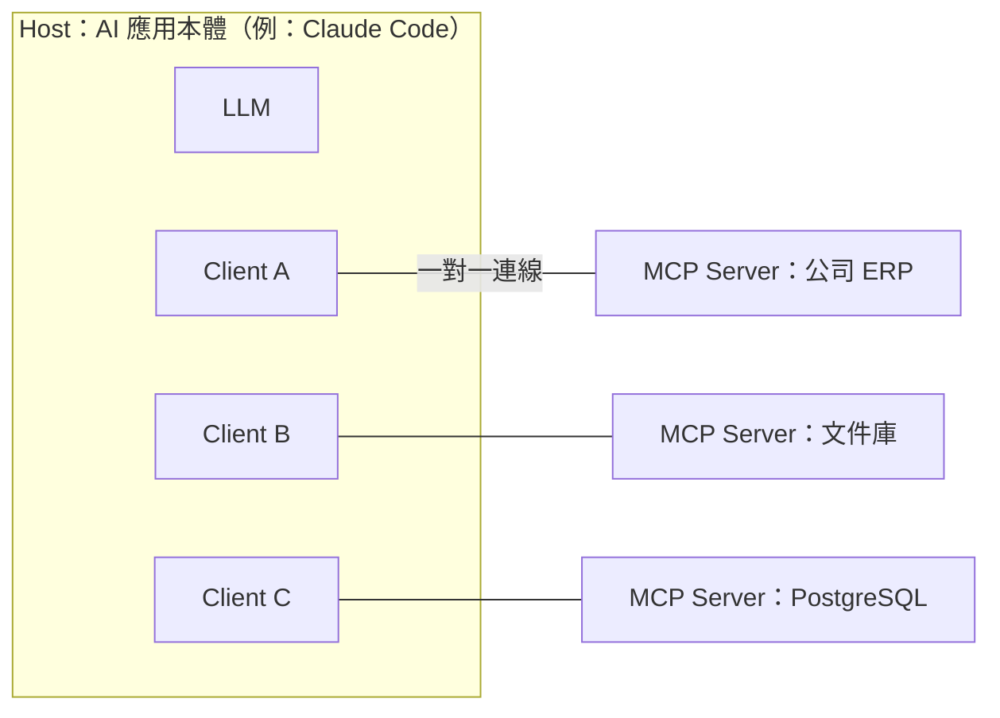

# Ch5 MCP：AI 界的 USB-C

## 本章目標

MCP 是本書的核心主題之一。讀完你能：<br>(1) 從 N×M 問題出發講清楚 MCP 為什麼存在；<br>(2) 白板畫出完整架構；<br>(3) 準備好 3 分鐘、30 分鐘、客戶版三種講法；(4) 把自建 server 的經驗整理成清楚的技術案例。<br>

---

## 5.1 為什麼存在：N×M 問題

想讓 AI 應用連上企業系統，在 MCP 之前的世界：

```
3 個 AI 應用（Claude、內部 chatbot、IDE 助手）
× 4 個系統（ERP、CRM、文件庫、資料庫）
= 12 條客製整合，每條都要自己寫、自己維護
```

每加一個新 AI 應用，全部整合重寫一遍；每加一個新系統，每個應用都要加一遍。這就是 **N×M 問題**。

**MCP（Model Context Protocol）** 的解法：中間立一個標準協定。應用只要「會說 MCP」（做一次），系統只要「提供 MCP server」（做一次），N×M 變成 **N＋M**。

比喻（客戶版開場白）：**USB-C**。以前每台裝置一種充電孔，現在大家都做 USB-C，任何充電器配任何裝置。「你們的內部系統只要包一層 MCP server，之後不管接哪一家的 AI 應用，整合都不用重做。」——這句話對企業 IT 主管有魔力，因為它回答了他們最怕的問題：**被單一 AI 供應商綁死**。

## 5.2 架構：Host、Client、Server



- **Host**：使用者面對的 AI 應用，總管一切
- **Client**：host 內部的連線管理員，與每個 server 一對一
- **Server**：把某個系統的能力用標準格式暴露出來的服務——**你這兩年自建的就是這個**

一個 server 通常很小（包一個系統、幾個工具），這是優點：職責單一、好審查、好授權。

## 5.3 Server 提供的三種東西

| 類型 | 是什麼 | 例子 |
|---|---|---|
| **Tools** | 模型可以「呼叫」的動作（對應 function calling） | `query_orders(customer_id)`、`create_ticket(...)` |
| **Resources** | 模型可以「讀」的資料 | 檔案內容、DB schema、設定檔 |
| **Prompts** | 預先寫好的提示模板，使用者可挑選套用 | 「產生週報」模板 |

實務上 tools 是主角（八成的 server 以 tools 為主），但三個都要能講得出來。

## 5.4 Transport：怎麼連

- **stdio**：server 作為 host 的子行程，走標準輸入輸出。本機工具的預設，簡單、無網路暴露面。
- **HTTP（含 SSE 串流）**：server 是遠端服務。跨機器、多人共用、雲端部署用這個，配 OAuth 做授權。

選型口訣：本機個人用 stdio，企業共用服務走 HTTP。

## 5.5 關鍵區別：MCP 與 Function Calling 的關係

最常見的混淆，釐清如下：

> 「兩者是**上下層**，不是競爭關係。Function calling 是**模型層機制**——模型如何表達『我要呼叫工具』；MCP 是**整合層協定**——工具怎麼被發現、連接、標準化提供。MCP server 的 tools，最終還是透過 function calling 給模型使用。MCP 解決的不是『模型怎麼用工具』，是『工具生態怎麼不用重複造輪子』。」

延伸一句：「所以 MCP 是供應商中立的開放標準——這正是企業願意投資包 MCP server 的原因：這層投資不會因為換模型供應商而作廢。」

## 5.6 自建一個 Server 有多簡單（去魅）

用官方 SDK，一個最小 server 大概長這樣（Python，示意）：

```python
from mcp.server.fastmcp import FastMCP

mcp = FastMCP("order-system")

@mcp.tool()
def query_order(order_id: str) -> str:
    """查詢訂單狀態。order_id 格式：A 開頭＋4 碼數字。"""
    return db.get_order(order_id).to_json()   # 權限檢查、參數驗證在這層做

mcp.run()  # 預設 stdio
```

重點不在程式量（很少），在**設計判斷**——關鍵在以下幾個問題：

- 工具切多細？（一個萬能 `run_sql` vs 三個具名查詢——後者可控、可授權、模型不易誤用）
- 誰做權限？（server 層做，不信任模型的自我約束）
- 錯誤怎麼回？（回可行動的訊息，引導模型修正參數）
- 描述怎麼寫？（寫給模型看的使用說明，決定模型選不選得對工具）

## 5.7 你的三種講法

- **3 分鐘電梯版**：N×M 問題 → USB-C 比喻 → 「我自建過 N 個 server：連了哪些系統、解決什麼重複整合的痛」→ 一個具體成效
- **30 分鐘白板版**：5.2 架構圖 → 挑一個你自建的 server 完整走：為什麼自建、工具怎麼切、權限與錯誤設計、踩過的坑（如 stdio 除錯、schema 演進）
- **客戶版**（對企業 IT 主管）：從「怕被綁死」講起 → 開放標準 → 「包一層 MCP，AI 應用隨便換」→ 資安答疑（server 在你們環境內、權限你們控、全程可審計）

**練習**：把你自建的 MCP servers 畫成一張架構圖（連了什麼系統、暴露哪些工具）——這是把你的 MCP 經驗講清楚最直接的方式。

---

## 常見誤解

1. **「MCP 取代 function calling」**——上下層關係，見 5.5。這題答錯會直接暴露沒真的動手做過。
2. **「MCP 是 Claude／Anthropic 專用」**——由 Anthropic 發起的**開放標準**，主流 AI 應用與供應商都在支援。供應商中立正是它的賣點。
3. **「MCP server 只能跑本機」**——stdio 是本機，HTTP transport 就是遠端服務。
4. **「有了 MCP 就安全了」**——MCP 標準化了「怎麼連」，沒有代辦「權限與驗證」。最小權限、參數檢查、審計，仍是 server 實作者（你）的責任。

## 自我檢測

1. 用 N×M 問題與 USB-C 比喻，3 分鐘講完 MCP 是什麼（計時，口頭）。
2. 白板默畫 host/client/server 架構，標出三種能力類型。
3. 「MCP 跟 function calling 什麼關係？」——用 5.5 的答案，完整說明。
4. 設計題：客戶要讓 AI 查 ERP 訂單——你會暴露一個 `run_sql` 工具還是具名工具？為什麼？
5. 企業 IT 主管問「這東西安全嗎？」——你的回答結構？

## 參考答案要點

    1–2. 見 5.1、5.2、5.3。
    3. 上下層：模型層機制 vs 整合層協定；tools 最終仍走 function calling。
    4. 具名工具：可控、可逐工具授權、schema 窄、模型不易誤用；`run_sql` 等於把整個 DB 的攻擊面交給模型。
    5. server 部署在客戶環境內＋權限在 server 層由客戶控制＋最小工具集＋全程審計日誌；MCP 是開放標準不綁供應商。
