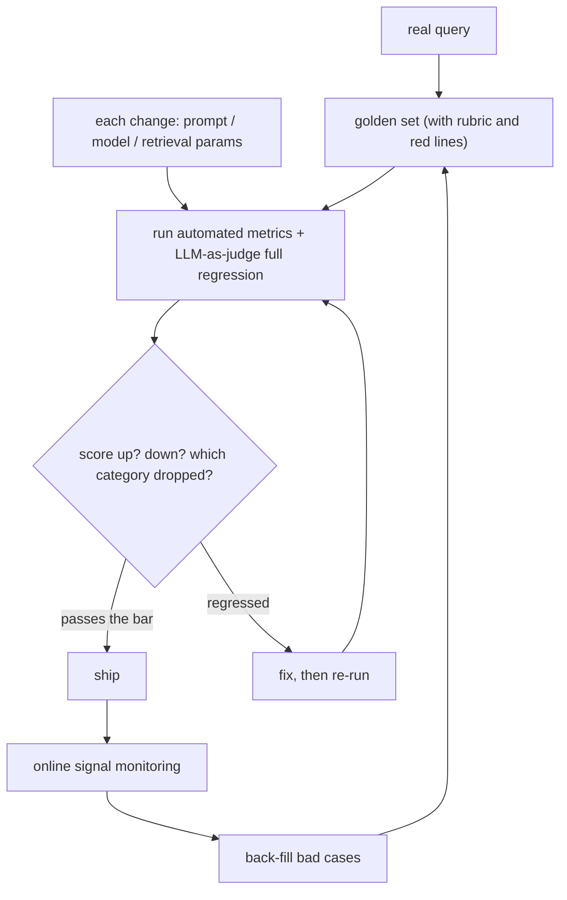

# Ch6 Evals: How to Prove Your AI System Actually Works

## Chapter Goals

This is the **make-or-break chapter** for interviews—"How do you know your system actually works?" Answer this badly and you're out. After reading it, you'll be able to: (1) explain the four-layer eval architecture; (2) actually build a golden set and an LLM-as-judge (in W3 you'll do this once for Trilo); (3) frame evals as "the test suite for an AI system."

---

## 6.1 Why Evals Are the Make-or-Break Question

Traditional software: fixed input → fixed output → just write test assertions.
LLM systems: outputs are probabilistic, and "correct" often has no single standard (Is the summary good? Is the tone right?)—**traditional asserts break down**.

So a brutal dividing line appears:

- People who can build a **demo**: cherry-pick three examples that went well and show them to the boss.
- People who can build **production**: can answer "across 500 real cases, what's the accuracy, which category is weakest, and did this change make it worse?"

What enterprise customers pay for is the latter. OpenAI's FDE team even bakes this into their process—"**build the eval first, verify it hits the bar, and only then deliver**" (see the three-phase model in `research/fde-role-research.md`)—the eval isn't post-delivery QA, it's a pre-delivery contract.

One line to say to an interviewer who's on your wavelength: **"The eval set is the test suite for an AI system. Changing a prompt without an eval is like changing production code with no tests."**

## 6.2 The Golden Set: The Foundation of Everything

A **golden set** = a batch of "input + expected result" test data. How to build one:

1. **Collect real inputs**: pull from real user queries and the customer's historical tickets—don't make up your own test cases (imagined cases are always cleaner than real ones)
2. **Layer your coverage**: common scenarios + edge cases + **red-line cases** (things that must never be wrong: safety, compliance, dollar amounts)
3. **Define "expected"**: for cases with a standard answer, write the standard answer; for those without, write a **scoring rubric**
4. **Start small**: 50–100 items is enough to get to work, then keep back-filling with bad cases you discover in production—**every production error should become an eval item** (same discipline as bug regression tests)

## 6.3 The Four-Layer Evaluation Architecture (The Standard Answer—Memorize It)

Cheap to expensive, fast to slow—four layers that complement each other:

### Layer 1: Automated Metrics (Judged by Code)

For the parts that have objective standards, verify directly with code: exact match, key-field comparison, format validity (JSON schema), whether cited document IDs are correct, retrieval hit rate (did the documents that should have been fetched land in the top-k). **Fast, free, and runnable in full on every change**—this layer is the workhorse of regression testing.

### Layer 2: LLM-as-judge (One Model Grading Another)

For things with no single correct answer (summary quality, answer completeness, tone), use another model to score against a **rubric**. Success or failure comes down entirely to how concrete the rubric is:

```
Bad rubric: "Is the answer quality good? Score 1–5"        ← vague, the judge will score randomly
Good rubric: item-by-item checks, each 0/1—
  [ ] Did it cite the correct source document?
  [ ] Did it include the specific amount and date?
  [ ] For content not in the document, did it explicitly say "not mentioned"?
  [ ] Are there no fabricated policy clauses?
```

**The judge must be calibrated**: have a batch scored by humans too, and compare the agreement rate; if agreement isn't high enough, fix the rubric. An uncalibrated judge is a feel-good machine.

### Layer 3: Human Review (Expensive—Use It Where It Counts)

Stratified sampling (sample more from high-risk categories and new features), with two annotators to check consistency. Human results also feed back to calibrate the Layer 2 judge—forming a closed loop.

### Layer 4: Online Signals (Most Real, Slowest)

User behavior (re-ask rate, edit rate, thumbs up/down), business metrics (handling time, escalation-to-human rate, complaints). This layer tells you whether your eval set has drifted from the real world.

## 6.4 Workflow: Eval-Driven Development



This diagram answers three common interview questions:

- "How do you safely swap models / change a prompt?" → Run the regression, look at the scores, and especially look at **the per-category breakdown** (total score up but the red-line category down = don't ship)
- "The customer says the model got dumber—how do you investigate?" → First run the eval to localize it: did the score really drop? Which category dropped? (connects to question bank #10: drift investigation)
- "What accuracy do we need before we can ship?" → Turn it back on the business: what's the cost of an error? Low-risk scenarios are usable at 90%, high-risk scenarios need 99% + a human-review gate. **The threshold is a business decision, the measurement is an engineering responsibility.**

## 6.5 RAG Evals Must Be Split in Two (Echoing Chapter 3)

RAG system evals must **measure retrieval and generation separately**:

- **Retrieval metric**: did the passage that should have been fetched make it into the top-k (hit rate/recall)
- **Generation metric**: given the correct passage, is the answer right (faithfulness/accuracy)

If you only measure the final answer, you'll never know whether to fix retrieval or fix the prompt—the diagnostic table in Chapter 3 only works if you measure these two parts separately.

---

## Common Misconceptions

1. **"I looked at a few examples, results were good"**—demo thinking. The examples you look at train your own bias; they aren't measurement.
2. **"92% accuracy, great"**—a single total score is meaningless: the red-line category might be at 60%. Always report by layer.
3. **"Do the eval once and you're done"**—an eval is alive: keep back-filling bad cases from production, or it drifts from the real world.
4. **"LLM-as-judge is unreliable, so don't use it"**—an uncalibrated judge is unreliable; a calibrated judge is the only way to scale. All-human is expensive, slow, and inconsistent.
5. **"Build the features first, worry about evals later"**—the order is backwards. Without an eval you can't even answer "did the change make it better," and every optimization becomes blind patching.

## Self-Check

1. The interviewer asks: "How do you know your AI system actually works?"—give a complete answer using the four-layer architecture (in under 3 minutes).
2. Design a golden set for an "insurance policy clause Q&A RAG": give an example each for source, layering, and red-line cases.
3. Write an LLM-as-judge rubric (in item-by-item check format), and explain how to calibrate the judge.
4. Why must RAG evals be split into retrieval and generation?
5. The customer asks "what % do we need before we can ship?"—what's your standard answer?

## Key Points for the Reference Answers

    1. Automated metrics → LLM-as-judge (rubric + calibration) → human stratified sampling → online signals; add the line "the eval set is the test suite for the AI."
    2. Real support tickets as the source; split into common policy types / edge cases / red lines (claim amounts and compliance wording must never be wrong); define a rubric per category.
    3. Item-by-item 0/1 checks; sample and have humans co-score to get an agreement rate, and if it doesn't hold up, fix the rubric and recalibrate.
    4. Two independent failure points; without splitting you don't know which end to fix (connects to the Ch3 diagnostic table).
    5. The threshold is a business decision (cost of an error), the measurement is an engineering responsibility; for high-risk cases, add a human-review gate rather than chasing 100%.
