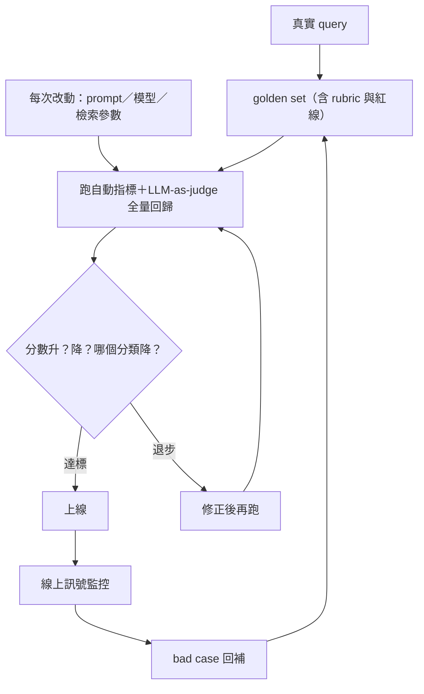

# Ch6 Evals：怎麼證明 AI 系統真的有效

## 本章目標

這是**關鍵的一章**——核心問題是「你怎麼知道你的系統真的有效？」讀完你能：<br>(1) 講出四層 eval 架構；<br>(2) 實際建一套 golden set 與 LLM-as-judge（W3 會為 Trilo 做一次）；<br>(3) 把 eval 講成「AI 系統的測試套件」。

---

## 6.1 為什麼 Evals 是 demo 與 production 的分界線

傳統軟體：輸入固定 → 輸出固定 → 寫測試斷言就好。
LLM 系統：輸出是機率性的、「對」往往沒有唯一標準（摘要好不好？語氣對不對？）——**傳統 assert 失效了**。

於是出現一條殘酷的分界線：

- 會做 **demo** 的人：挑三個順利的例子給老闆看。
- 會做 **production** 的人：能回答「在 500 個真實案例上，正確率多少、哪類最弱、這次改動有沒有讓它變差」。

企業客戶付錢買的是後者。OpenAI 的 FDE 團隊甚至把流程定成「**先建 eval、驗證達標、才進交付**」（見 `research/fde-role-research.md` 三階段模型）——eval 不是交付後的品管，是交付前的合約。

一句話總結：**「Eval set 就是 AI 系統的測試套件。沒有 eval 改 prompt，等於沒有測試改 production code。」**

## 6.2 Golden Set：一切的地基

**Golden set**＝一批「輸入＋期望結果」的測試資料。怎麼建：

1. **收集真實輸入**：從真實使用者 query、客戶歷史工單來——不要自己想像題目（想像的題目永遠比真實的乾淨）
2. **覆蓋要分層**：常見情境＋邊界情況＋**紅線案例**（絕不能錯的：安全、合規、金額）
3. **定義「期望」**：有標準答案的寫標準答案；沒有的寫**評分準則**（rubric）
4. **從小開始**：50–100 筆就能開始工作，隨線上發現的 bad case 持續回補——**每個線上錯誤都應該變成一筆 eval**（跟 bug 迴歸測試同一個紀律）

## 6.3 四層評估架構

由便宜到貴、由快到慢，四層互補：

### 第一層：自動指標（程式判）

有客觀標準的部分用程式直接驗：exact match、關鍵欄位比對、格式合法性（JSON schema）、引用的文件 ID 是否正確、檢索命中率（該撈到的文件有沒有在 top-k 裡）。
**快、免費、可每次改動全量跑**——這層是回歸測試的主力。

### 第二層：LLM-as-judge（模型評模型）

沒有唯一標準答案的（摘要品質、回答完整性、語氣），用另一個模型按 **rubric** 打分。成敗全在 rubric 具體度：

```
壞 rubric：「回答品質好嗎？1–5 分」          ← 模糊，judge 會亂給
好 rubric：逐項檢核，各項 0/1——
  [ ] 是否引用了正確的文件出處？
  [ ] 是否包含具體金額與日期？
  [ ] 是否對文件中沒有的內容明說「未提及」？
  [ ] 是否無捏造的政策條款？
```

**Judge 必須校準**：抽一批人工也打分，比對一致率；一致率不夠就修 rubric。沒校準過的 judge 是自我感覺良好機器。

### 第三層：人工審查（貴，用在刀口）

分層抽樣（高風險類別多抽、新功能多抽），雙人標註看一致性。人工結果同時回頭校準第二層的 judge——形成閉環。

### 第四層：線上訊號（最真實，最慢）

使用者行為（重問率、修改率、讚踩）、業務指標（處理時長、轉人工率、客訴）。這層告訴你 eval set 跟真實世界有沒有脫節。

## 6.4 工作流：Eval 驅動開發



這個圖回答了三個常見問題：

- 「怎麼安全地換模型／改 prompt？」→ 跑回歸，看分數，尤其看**分類細項**（總分升但紅線類降＝不能上）
- 「客戶說模型變笨了怎麼查？」→ 先跑 eval 定位：分數真降了嗎？哪類降？（drift 調查）
- 「準確率多少才能上線？」→ 反問業務：錯誤的代價是什麼？低風險場景 90% 可用，高風險場景 99% ＋人審關卡。**門檻是業務決策，量測是工程責任**。

## 6.5 RAG 的 eval 要拆兩段（呼應第三章）

RAG 系統的 eval 必須**分開量測檢索與生成**：

- **檢索指標**：該撈到的段落有沒有進 top-k（命中率/recall）
- **生成指標**：給了正確段落時，答案對不對（faithfulness／正確率）

只量末端答案，你永遠不知道該修檢索還是修 prompt——第三章的診斷表能運作，前提就是這兩段分開量。

---

## 常見誤解

1. **「我看了幾個例子，效果不錯」**——demo 思維。看的例子＝訓練你自己的偏見，不是量測。
2. **「準確率 92%，很好」**——一個總分毫無意義：紅線類別可能是 60%。永遠分層報告。
3. **「eval 做一次就好」**——eval 是活的：線上 bad case 持續回補，否則跟真實世界脫節。
4. **「LLM-as-judge 不可靠，所以不用」**——沒校準的 judge 不可靠；校準過的 judge 是規模化的唯一解。全人工又貴又慢又不一致。
5. **「先做功能，eval 以後再說」**——順序反了。沒有 eval 你連「改動有沒有變好」都答不出來，所有優化都是盲修。

## 自我檢測

1. 「你怎麼知道你的 AI 系統真的有效？」——四層架構完整作答（3 分鐘內）。
2. 為一個「保單條款問答 RAG」設計 golden set：來源、分層、紅線案例各舉例。
3. 寫一個 LLM-as-judge 的 rubric（用逐項檢核格式），並說明怎麼校準 judge。
4. 為什麼 RAG 的 eval 要拆檢索與生成兩段？
5. 客戶問「要到幾 % 才能上線？」——你的標準回答？

## 參考答案要點

    1. 自動指標→LLM-as-judge（rubric＋校準）→人工分層抽樣→線上訊號；加一句「eval set 是 AI 的測試套件」。
    2. 真實客服工單為源；分常見險種/邊界/紅線（理賠金額、法遵措辭絕不能錯）；每類定 rubric。
    3. 逐項 0/1 檢核；抽樣人工同評比一致率，不合就修 rubric 重校。
    4. 兩個獨立故障點；不拆就不知道修哪端（接 Ch3 診斷表）。
    5. 門檻是業務決策（錯誤代價），量測是工程責任；高風險配人審關卡而不是硬追 100%。
